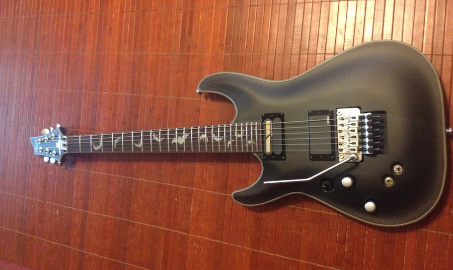

The unboxing of a new Damien 6 guitar by Schecter with a Sustainiac pickup has led to inspiration for new music.

Let's start with why this guitar is a great instrument, particularly for someone who likes to make a great variety of sounds...

## Sustainiac pickup

In the neck position is a Sustainiac pickup. Those switches you see near the tremolo do two things: switch the sustain on and off and switch that sustain between three varieties: standard, harmonic, and mixed.

A Sustainiac pickup allows a note to ring indefinitely. It uses magnetic feedback to make the string continue to vibrate. This allows for all sorts of sonic possibilities.

The possibilities are especially wide when you factor in the afforementioned harmonics mode, which will cause the strings' harmonic tones to ring. Play a note, and it soon morphs into a squealing high-pitched tone. Slide the notes around, and all sorts of sounds emerge. Use the tremelo, and things get even weirder.

## Bat inlays

This does nothing for the sound, but look at them! Bat inlays!

## New music

Don't expect anything immediate, or even for the near future, but I am back in business as a musician.

With an ambitious project well underway, and several songs nearly completed, I took a long hiaitus. My lack of motivation was probably due to losing all of the files for that project after losing both the hard drive and its backup. In addition, I began having a range of other technical difficulties, and it sapped my will.

But music is compulsive for me, so it's time to get back to work.

I haven't settled on a particular project. I was considering playing around with instrumental guitar-heavy psychedelic strangeness. I've played guitar far longer than I've been recording, but I've never used my guitar very much in my recordings. I figure it's time to change that. But we'll see.

For a DAW, I'm trying out Reaper. So far, I think I may be enjoying it even more than Sonar, which was my DAW of choice in the past.
