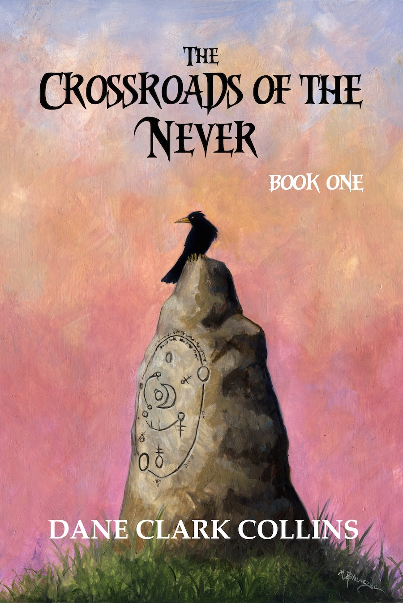

The first book in the _Crossroads of the Never_ saga is coming soon. The cover art by Michael Bielaczyc has just been unveiled!

## And so it begins...

The first book in the new series, the _Crossroads of the Never_, has been completed. It is at the printer and the first proof is in the works. The book will become availabe in print as soon as it is ready.

If you would like to be emailed updates, please sign up for the mailing list in the form to the right. Don't worry, this isn't a marketing company, so you'll only get updates regarding my work, and those will not come often. Those who sign up may receive special pricing on this and other upcoming projects.

I'd like to thank Michael Bielaczyc for his help and support on this project, and especially for the incredible cover art that will grace the front of the book.

## Book description:

For Toryn Ninefingers, this is almost like any other night, entertaining a rowdy crowd with song and story. But tonight, he has a special purpose in the telling of his tale, and reveals a shocking personal story that he has never told an audience before. With its telling, Atheles may never be the same again.

This is the first book in the _Crossroads of the Never_ saga, a series spanning thousands of years, shedding light on the dark and disturbing mysteries of the world of Uteria—a world besieged by the passing of a dark age, the continuing echoes of its violent history, and the recent incursion of creatures long since forgotten.