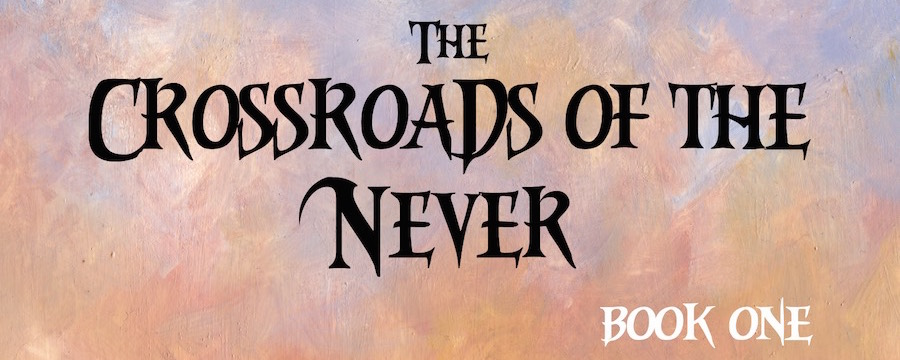

The first book in _The Crossroads of the Never_ saga is now available in both paperback and Kindle eBook. Purchase through Sagaborn.com or Amazon.

## Order your copy now...

I'm happy to announce that _Crossroads of the Never: Book 1_, my first book of fiction set in Atheles, is now available on both paperback and ebook through Sagaborn.com and Amazon.

<a href="http://www.sagaborn.com/store/crossroads" target="_blank">Click here to purchase the paperback through Sagaborn.com.</a>

<a href="http://www.amazon.com/gp/product/1508591652/ref=as_li_tl?ie=UTF8&camp=1789&creative=390957&creativeASIN=1508591652&linkCode=as2&tag=danclacol-20&linkId=Y5CYA7JBUSMSQOSK" target="_blank">Click here to purchase the paperback or Kindle ebook through Amazon.com.</a>

More booksellers and ebook options will become available very soon, including B&N, iBooks, DriveThruFiction, and every other major online retailer!

## Book description:

For Toryn Ninefingers, this is much like any other night, entertaining a rowdy crowd with song and story. But tonight, he has a special purpose in the telling of his tale, and reveals a shocking personal story that he has never told an audience before. With its telling, Atheles may never be the same again.

This is the first book in the _Crossroads of the Never_ saga, a series spanning thousands of years, shedding light on the dark and disturbing mysteries of the world of Uteria—a world besieged by the passing of a dark age, the continuing echoes of its violent history, and the recent incursion of creatures long since forgotten.
