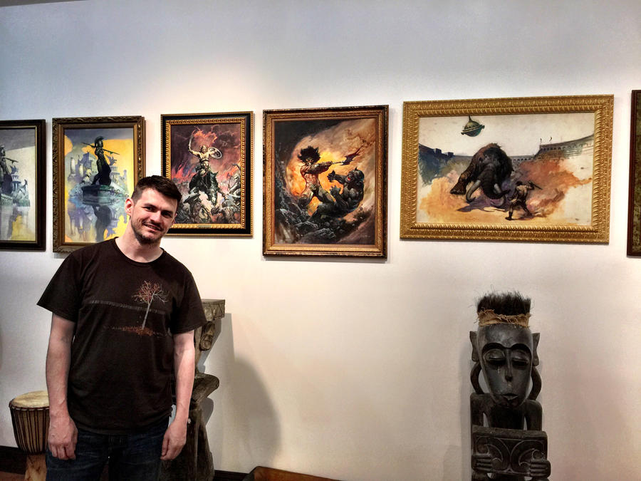

Here is the first man whose art I feared. Actually, that’s not entirely true...there had been a few horror novels with covers that made me afraid, but that had been a surface fear. The dread conjured by a Frazetta painting was something deeper; it was visceral. His work was the first to transport me to a mythical world—an ancient and primitive world, where the terror of the unknown lurked in every shadow, dangerous even for the mightiest of men.

I remember the cover of the first _Conan_ paperback by Lancer/Ace Books. This Conan was not a hero in gleaming armor, nor was he even a fearless warrior, confidently facing his enemies. Rather, Conan’s face here is a mix of terror and fury, facing his mortality against a primitive ape-like beast that is equally crying in terror and fury. This is not a battle of good versus evil. It is purely a battle of survival, and one or both of the combatants is about to suffer and die. The mood here is of brutal desperation.

I read _Conan_, and then I read the next book in that series, _Conan of Cimmeria_. Again, I found myself mesmerized by the cover art as much as the words within. Again, we have Conan, not as a hero, but as a desperate man trying to survive. This time, he faces two massive men with axes and murderous intent. But it was not the antagonists, this time, that held my attention. It was the hopelessness and desolation of the environment. Conan faces his assailants alone in the secluded depths of frozen peaks. As with many of Frazetta’s paintings, the landscape is only vaguely detailed, and yet it is that hostile yet amorphous terrain that invokes such feelings of dread—the terror of becoming lost in those exposed peaks and tenebrous valleys that are only hinted at. Even if Conan comes out of this battle victorious, one might think, it appears likely he will soon be a frozen corpse, having died meaninglessly on some icy slope.

In my childhood, I can point to several turning points that led, bit by bit, to my desire to write. Those book covers (along with the stories within) are among the earliest and most profound. I wanted to invoke feelings that our mundane world can rarely reach—those fears that our modern society has left behind, but that our collective memory can still sense lurking in the recesses of our minds. I wanted to inspire the same primal awe and dread that Robert E. Howard and Frank Frazetta had inspired in me.

I’ve since experienced that same sense of awe and fascination in other works, such as Francisca Goya’s _Saturn Devouring His Son_, or William Blake’s _Nebuchadnezzar_. This puts Frazetta in good company. Sure, he did some highly commercial work and comic art that, despite its greatness, doesn’t quite stir the myth-fear-center of my mind the same way. But when the man tapped his well of inspiration, truly spiritual creations emerged.

The museum is in Stroudsburg, PA, nestled in a remote riverside dale of the Pocono Mountains. This was Frank’s home that he designed himself, many years ago. It seemed the perfect home for such an artist, and the perfect location for his museum. I could imagine living and writing in such a place.
