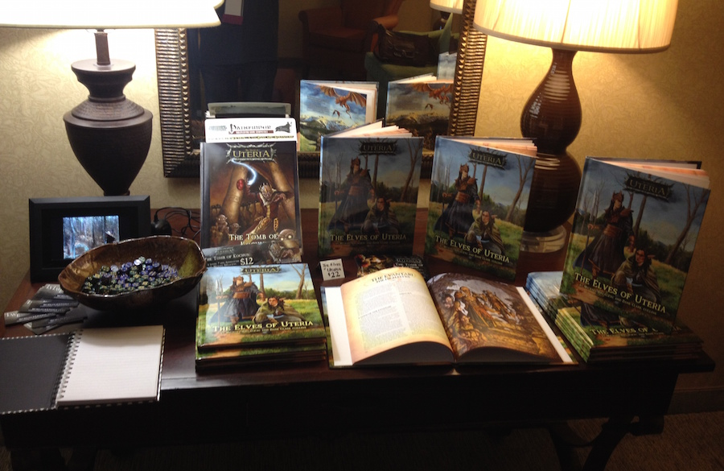
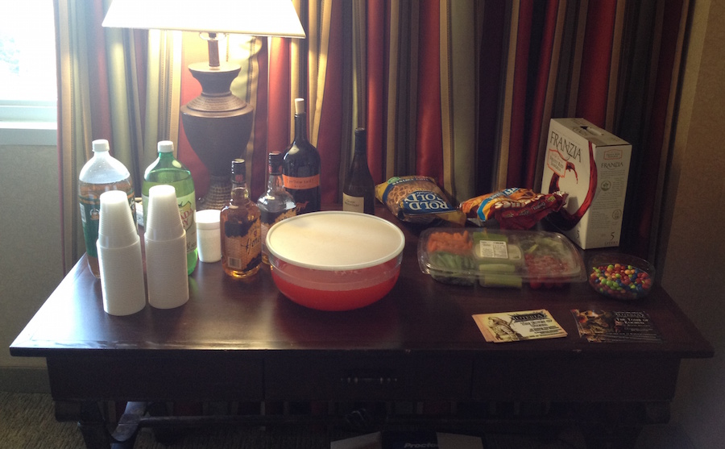

I attended Jordancon 6 (2014), the annual convention honoring the work of Robert Jordan (along, now, with other works of fantasy fiction). I had a panel to discuss the world of Uteria and we threw an incredibly fun launch party for the new book, _The Elves of Uteria_.

## Here are a few tl;dr highlights:

* Larry Elmore interpretive danced with Michael Bielaczyc.
* Did I mention Larry Elmore was there? I was able to hang out with him a bit.
* The Elves of Uteria launch party was a huge success. Many people came, and much alcohol was consumed. Books were signed, and a good time was had by all.
* Michael Bielaczyc, Paul Bielaczyc, Sam Flegal, Melissa Gay, and I spoke on a panel called "Elves of Uteria: World Building." It went much better than I had imagined it would, given my lack of public speaking skills.
* Creepy dolls.
* Patrick Rothfuss was the Writer Guest of Honor. I watched several of his panels, and came away from each just a little bit smarter than I was before.
* Brandon Sanderson was also in attendance, but my schedule never presented an opportunity to meet him or see one of his panels. Hopefully I'll be able to make up for it in the future.

It was a great time, and as tired as I am, I'm a bit sad that it's over.

Thanks to everyone for making it such an excellent event, especially the organizers and staff! They did a tremendous job.

## The launch party

The best part of the show, for us, was the Elves of Uteria launch party. After a successful Kickstarter campaign and an expedited production cycle, we were ready to come to the show with a good number of printed hardbacks, which we sold quickly.

Many of the artists whose contributions appear in the book were in attendance, so we gave them all pens and ensured that anyone who got a book walked out with it looking much like a high school yearbook, filled with signatures and sketches.

Now it's time for Mike and I to begin preparations for the supplemental material that we promised in the Kickstarter, including an introductory module and city guide for Ferryport.
