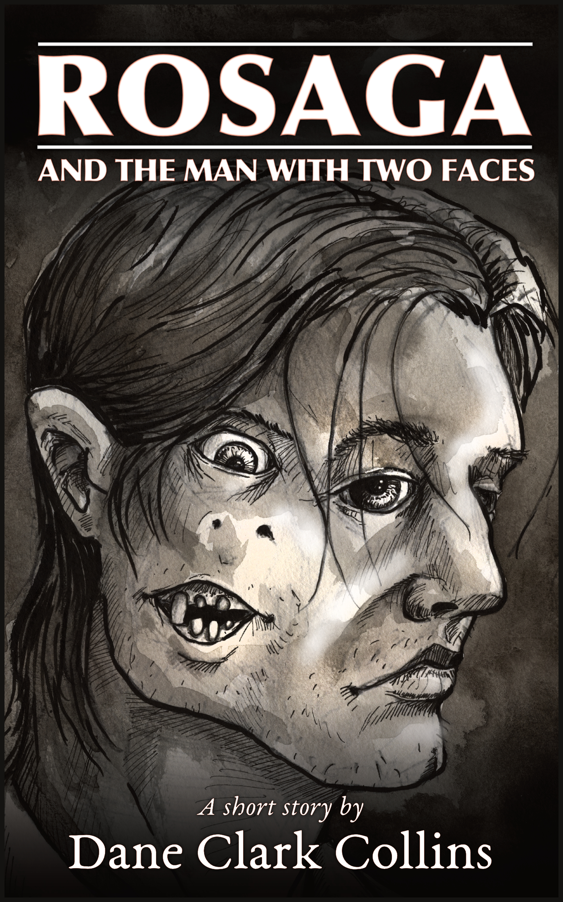

I’m pleased to announce that I have a new short story up on both SagaBorn.com and Amazon. It is available in all major ebook formats for [free at SagaBorn.com](http://www.sagaborn.com/store/rosaga), or if you’d like to read it on your Kindle, you can get it for [$0.99 on Amazon](http://amzn.to/1WN7bb2 "Purchase Rosaga and the Man with Two Faces at Amazon").

## Book description

A terrifying fantasy story from Dane Clark Collins, author of _Crossroads of the Never_.

Long after disappearing on a quest to chase his hallucinatory visions, Dreisin has resurfaced with a story stretching twelve hundred years into the past: a chilling tale of dark magic, cursed love, and a fate far worse than death. This is the tale of _Rosaga and the Man with Two Faces_.

<a href="http://www.sagaborn.com/store/rosaga" class="button">Free at SagaBorn</a> <a href="http://amzn.to/1WN7bb2" class="button">$0.99 at Amazon</a>

