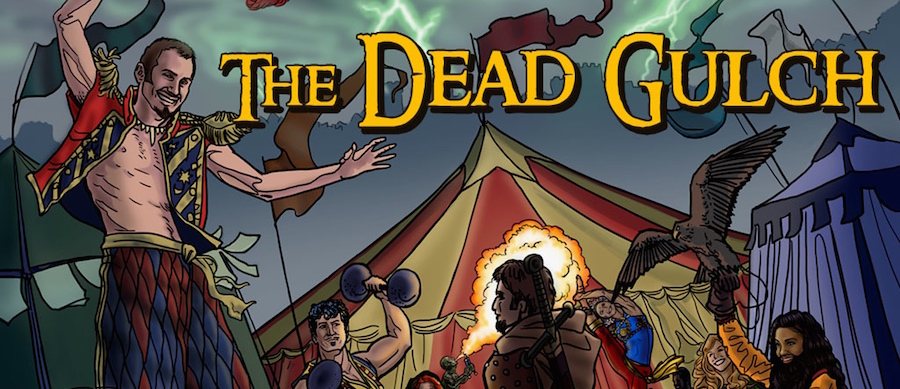

Thanks to the support from fans of Uteria, _The Dead Gulch_ has been funded, and has reached a funding goal to include a short story written by me.

### What is _The Dead Gulch_?

_The Dead Gulch_ is a Pathfinder Roleplaying Game-compatible role playing adventure designed for 4 to 6 characters of 2nd level. This adventure is part 2 of the _Ferryport Adventures: Return of the Fey_ adventure path, set in the dark world of Uteria.

The adventure is "node based", which means that players can choose their own path, discovering locales and clues as they follow their own investigations and intuitions.

The characters will advance from level 2 to level 4 by the end of the module. The book comes with 7 pre-made characters who all hail from different parts of Uteria.

_The Dead Gulch_ is authored by Michael Bielaczyc, Shonn Everett, and Cameron Tomele, with some contributions and editing by me. It includes art by Melissa Gay, A.L. Ashbaugh, Michael Bielaczyc, Paul Bielaczyc, Christopher Burdett, Sam Flegal, Dennis Skotak, Robert Skotak, Alex Garrett, and Mitch Foust.

### And what about the short story?

Michael included as one of the funding goals (if funding went beyond what had been asked for): "A piece of short fiction by Dane Clark Collins will be included in the adventure."

I'll go ahead and let you in on what I've planned thus far: not a damn thing! I honestly had forgotten about this funding goal until a moment ago when I saw it said "unlocked." But I have had some great ideas rolling around in my head, and most likely, you can expect this story to be a little unsettling.

A few people have said that Book 1 of _Crossroads of the Never_ left them wanting more, and they are frustrated they have to wait. Don't worry, great progress has been made on the continuing saga of Toryn Ninefingers, and this short story won't be a setback.

_* Cover art by [Mellisa Gay](http://www.melissagay.com/)_
